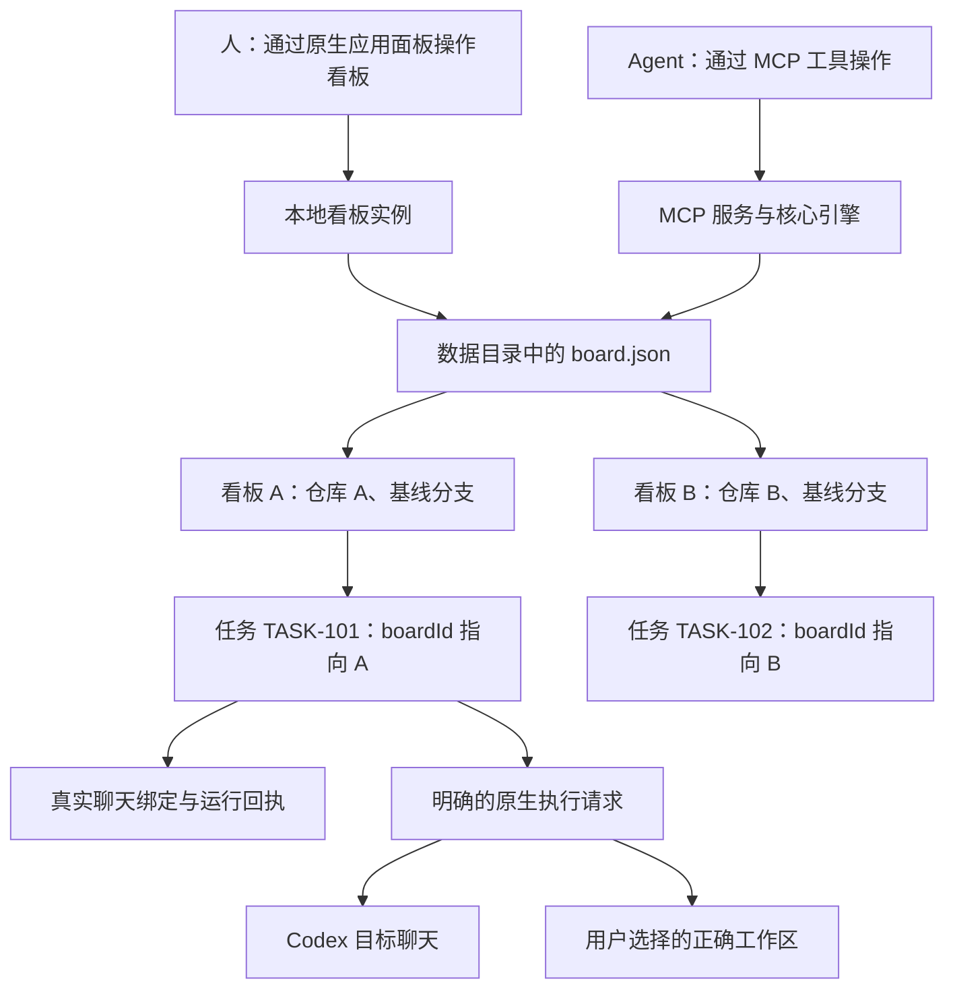
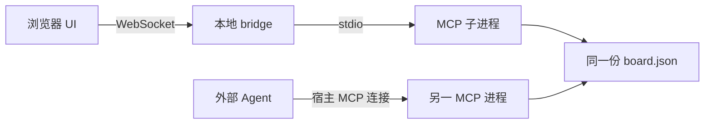
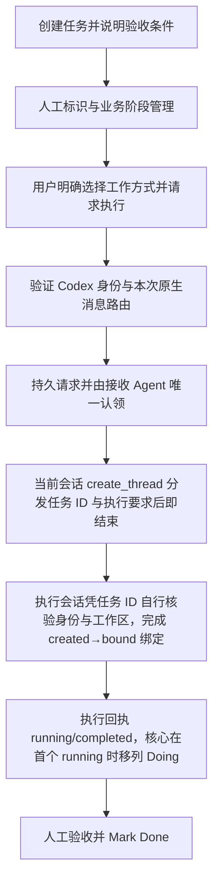
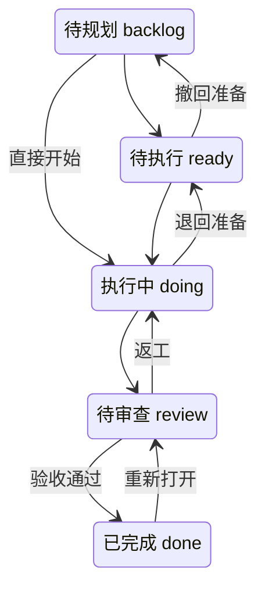
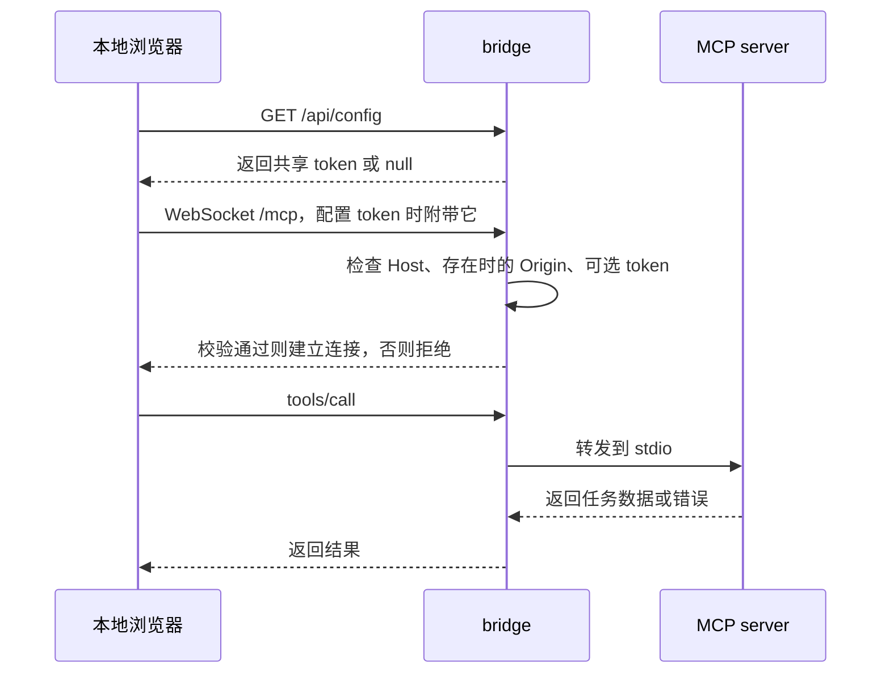

# 看板使用方法与工作流

本文描述 TaskLane（`tasklane`）当前实现。看板用于让人和编码 Agent
通过同一组 MCP 工具管理任务、执行状态及 Git 变更摘要。

默认打开方式是通过插件 MCP 工具 `open_tasklane` 请求 Codex 原生应用面板。
插件已声明全局与线程入口及 `fullscreen` UI 资源；需重新构建、加载插件并完成
原生宿主内验收。独立浏览器用于明确要求的开发或验证，真实会话执行仍依赖宿主
执行桥，不能把独立 UI 的效果视为 Codex 原生面板实测结果。

## 1. 实例、仓库、任务和用户的关系



- **数据目录决定任务数据集**：使用同一个 `TASKLANE_HOME` 的进程共用
  `board.json`；使用不同目录则拥有不同数据集。
- **一个实例可管理多个仓库**：通过界面的“添加仓库”或 `board_create` 注册
  已有本地 Git 仓库，每个仓库对应一个看板。同一仓库（含子目录、符号链接
  与 worktree 视角）只会注册一次。任务显式归属看板（`boardId`），
  任务 ID 在整个数据集中全局唯一。
- **当前选择属于客户端**：浏览器把正在查看的看板保存在本地存储中；
  服务端不维护全局“当前仓库”。切换看板只切换展示，不会停止、重派
  后台任务，也不会改变 Agent 或其他浏览器正在操作的看板。
- **本地单用户模式**：没有用户登录、角色权限、用户间的数据隔离或操作者身份记录。
  `human` / `agent` 仅表示任务指派类型，不是经过认证的用户身份。
  多仓库隔离是任务数据归属管理，不等于用户权限隔离。
- **分支不是权限边界**：在当前共享访问模式下，能访问实例的客户端可调用同一组
  工具。系统不会根据 Git 分支判断操作者是谁，也不会限制“自己的任务”。

## 2. 启动看板

### 2.1 首次准备

在本项目根目录执行，需 Node.js 20.6 或更高版本。
登记项目看板需要可用的 Git 和已经初始化的本地仓库；创建任务分支/worktree
还需目标仓库已有提交且基线分支存在。

```bash
pnpm install
pnpm build:plugin
```

构建后的自包含插件位于 `plugins/tasklane/`。按 Codex 当前插件安装流程加载
该目录后，在项目会话中请求“通过 MCP 打开当前项目的 TaskLane 看板”。
Agent 应调用 `open_tasklane({ projectDir: "/path/to/current-workspace" })`，
全局看板调用 `open_tasklane({})`。工具未暴露时先发现工具；仍不可用则报告插件
未加载或工具未提供。不能以启动 bridge 或打开浏览器 URL 代替原生面板打开。

项目仓库已有提交时，基线分支必须存在，默认基线为 `main`。仓库已执行
`git init` 但尚无提交时，允许使用当前待首次提交的分支作为基线并打开看板；
若使用 `git init -b master`，调用时需传 `baseBranch: "master"`。创建、编辑任务
和人工流转不要求仓库已有提交。打开工具返回错误时应保留并说明原因，不擅自
提交仓库，也不改用其他仓库或全局模式掩盖失败。

### 2.2 显式使用独立浏览器模式

以下方式仅用于用户明确要求浏览器或进行独立开发验收时。

将下面的示例路径替换为实际的目标仓库路径；命令仍在本项目根目录执行。

```bash
TASKLANE_HOME="/path/to/your-repo/.tasklane" \
TASKLANE_REPO="/path/to/your-repo" \
TASKLANE_BASE_BRANCH=main \
TASKLANE_BOARD_NAME="我的项目" \
pnpm sidebar
```

打开 [本地看板](http://127.0.0.1:7433)，等待顶部显示“MCP 已连接”。
`sidebar` 会构建 UI、启动 bridge，并由 bridge 拉起一个 MCP 子进程，
无需额外启动 `pnpm mcp`。在启动它的终端按 `Ctrl+C` 停止服务。

只体验任务管理、不创建 Git 分支和 worktree 时，可使用：

```bash
TASKLANE_HOME="/path/to/kanban-data" \
TASKLANE_GIT=off \
pnpm sidebar
```

| 配置 | 作用 | 默认值 |
| --- | --- | --- |
| `TASKLANE_HOME` | 数据目录，内含 `board.json` | `~/.tasklane` |
| `TASKLANE_REPO` | 目标本地仓库 | 未配置，Git 功能降级 |
| `TASKLANE_BASE_BRANCH` | 创建任务分支的基线 | `main` |
| `TASKLANE_BOARD_NAME` | 看板名称 | `Default Board` |
| `TASKLANE_GIT` | 设为 `off` 关闭 Git 功能 | 启用 |
| `PORT` | bridge 端口，仅监听 `127.0.0.1` | `7433` |

仓库、名称和基线配置用于初始化新的看板数据。已有 `board.json` 会沿用其中
保存的看板配置；修改环境变量不会自动把已有任务迁移到另一个仓库。
环境变量只在首次创建数据文件时生效；之后新增仓库使用界面“添加仓库”
或 `board_create`。旧 v1/v2/v3 文件在锁内备份 `.vN.bak` 后原子升级 v4。升级前停用同数据目录
的旧写进程；任务、归档、序号、时间线和 Git 绑定保留。

### 2.3 添加更多仓库

启动后即可在界面顶部随时添加仓库，无需重启或配置多个数据目录：

1. 点击顶部的“添加仓库”（⊞）按钮。
2. 填写本机仓库绝对路径；名称省略时使用仓库目录名，基线分支默认 `main`。
3. 提交成功（或该仓库此前已注册）后自动切换到对应看板。

路径必须是已存在的非裸本地 Git 仓库。已有提交时基线分支必须存在；尚无
提交时基线必须是当前待首次提交的分支（若为 `master`，需修改默认基线）。
裸仓库、非 Git 目录或无效基线会返回明确错误并保留已填输入。注册校验始终需要可用的 Git，
即使启动配置为 `TASKLANE_GIT=off`（该开关关闭任务变更摘要等 Git 功能，不改变指派语义）。

### 2.4 同时让 Agent 访问看板

原生插件已通过宿主 MCP Apps 桥让 UI 和 Agent 调用同一服务。若明确使用独立
浏览器且需要另一个 Agent 连接，可将普通 MCP 入口配置为构建后的
`mcp/dist/src/index.js`，并让宿主启动的 MCP server 使用与 UI
**相同的绝对数据目录**及仓库配置。

`TASKLANE_GIT` 是各个 MCP 进程自身的开关，需分别配置；仓库、名称和
基线分支则以共享数据文件中保存的看板配置为准。



这样 Agent 的工具调用与浏览器操作共享任务数据。UI 连接后每 4 秒刷新列表和
打开中的详情，操作成功后也会立即刷新。实际宿主加载配置的方法需按宿主支持的
方式接入；普通 stdio 服务只注册业务工具，不提供 `open_tasklane` 和 UI 资源，
不能用该服务替代原生插件服务。

### 2.5 宿主内两种打开入口（项目 / 全局）

Codex 插件通过 `open_tasklane` 打开原生应用面板，按入参区分模式。面板从 MCP
资源加载，无需浏览器 URL；`fullscreen` 表示应用显示模式，最终位置由宿主布局控制。

| 入口 | 调用 | 行为 |
| --- | --- | --- |
| 项目聊天内 | `open_tasklane({ projectDir, baseBranch? })` | 锁定该工作区所属仓库的看板；未登记时自动注册 |
| 全局侧边栏 | `open_tasklane({})` | 显示仓库选择器与“添加仓库”，管理全部看板 |

- 项目会话调用工具时，Agent 显式传入当前聊天的工作区绝对路径 `projectDir`；
  全局与线程入口声明不保证宿主自动补充该参数，若宿主传 `{}` 仍是全局模式。
  不从插件目录推断工作区；
  子目录 / worktree 打开时归位主仓库并复用同一看板。
- 自动注册幂等；基线分支优先用显式 `baseBranch`，否则默认 `main`。
  已有提交时验证基线存在，尚无提交时验证基线与当前待首次提交的分支一致。
  打开失败（路径无效、非 Git 目录、基线无效）时显示明确错误，
  不回退到其他仓库，也不修改仓库分支或任务状态。
- 项目模式隐藏切换与添加入口并锁定 `lockedBoardId`：刷新、重连后仍恢复
  原项目，不读写全局模式的浏览器选择。项目 A、项目 B 和全局看板可同时打开，
  任务 ID 与执行状态在两种入口查看同一仓库时完全一致（同一份 board.json）。
- 项目模式是 widget 的操作范围约束，不是多用户权限边界。详见
  [Extension 接入说明](extension/README.md)。

## 3. 界面使用方法

1. **切换仓库看板**：顶部选择器列出全部看板及各自任务数，切换立即清空
   旧看板的列表、详情与搜索状态并加载目标看板；刷新页面后恢复上次选择
   （选择失效时回退到第一个可用看板）。
2. **查看任务**：窄视图（小于 760px）使用状态标签和单列卡片；
   宽视图显示五列看板。初始窄视图选中 `Doing`，新任务不一定显示在当前标签下。
   列表与计数只包含当前看板自己的任务。
3. **创建任务**：点击“新建任务”，填写标题、描述、优先级和初始状态。
   任务归属提交时的当前看板，不因中途切换而写到其他仓库。UI 默认 `P2`、`Ready`、人工标识；
   直接调用 `task_create` 时，省略状态默认 `backlog`。
4. **请求执行**：在详情明确选择工作方式和模型，再点击「在 Codex 中执行」。
   有效请求在核心同一次事务中自动标记为 Agent；没有独立指派切换或创建后自动指派。
   Agent 标识不代表已运行，开始时间仍等待目标聊天的真实回执。
5. **编辑和流转**：点击卡片打开详情；标题、描述失焦后保存，优先级选择后保存。
   通过 `Status` 选择允许的目标状态；宽视图也可拖拽卡片到目标列。
6. **查找任务**：顶部“更多操作”可搜索 ID、标题、分支，并手动刷新。
   主题按钮可切换浅色/深色模式。
7. **连接中断**：UI 保留已有数据显示断连提示，禁用写操作并自动重连。
   保留的数据可能已过期，应等待重新连接后再继续。恢复后会重读看板列表
   与当前仓库任务。

## 4. 从需求到完成的工作流



Run Codex 的流转分工：接收请求的当前会话认领后只调用一次 `create_thread`，
把任务 ID 和“执行任务并把执行结果用工具更新到看板”的要求原样分发，随即结束；
不等待创建结果、不调用 wait_threads/read_thread 获取目标身份、不保存绑定、
不移动看板列。执行会话凭任务 ID 自行读取任务与本轮关联，核验自身真实
threadId/hostId 与工作区后完成 created→bound 绑定，执行并通过 MCP 工具回写
running/completed；MCP 工具对所有会话通用，绑定与回执不依赖会话间通讯。
worktree 由宿主异步创建，由执行会话在工作区就绪后自行完成绑定。
只有目标聊天回执才 running。

能力未验证时停在普通看板管理，不加入备用执行器。投递成功和业务状态变化都不能
代替真实开始回执。工作区、审批和执行属于 Codex；提交、合并不由 TaskLane 自动执行。

### 4.1 任务状态流转



这是 `task_move` 的完整允许流转集合。不能从 `doing` 直接进入 `done`，
也不能移到当前状态；违规调用会返回错误。创建接口可以指定初始状态，
因此上述约束针对已有任务的移动操作。

### 4.2 任务状态与执行状态是两套字段

任务状态描述工作阶段；`execution.state` 描述 Agent 执行情况。
例如任务仍处于 `doing` 时，执行态可以是 `running`、`waiting` 或 `failed`。

| 操作 | 看板实际变化 | 真实执行边界 |
| --- | --- | --- |
| Run Codex／继续执行 | 已连接 Codex 下明确工作方式，持久请求和 runId，并在同一事务中自动标记 Agent | 当前会话只创建任务聊天并分发任务 ID 与执行要求，绑定与回执由执行会话通过 MCP 完成，只有目标聊天回执才 running |
| MCP task_assign（无 UI 入口） | 仅保留显式元数据管理；保留原聊天、执行回执和 Git 字段 | 不启动、不停止、不创建工作区 |
| 回复、继续、重试 | 新请求代次，完整回复，复用绑定聊天 | 未确认请求不重发，投递不等于恢复运行 |
| Stop | 禁用且说明原因 | 未验证可靠中断接口 |
| 手动 Doing/Review/Done | 只改业务阶段；Review 可刷新已有工作区摘要 | 不伪造 running/completed，不自动提交或清理 |

旧 sess-* 只是内部标识，旧 running 没有真实回执时显示“未核实”。
刷新/断连/上下文改变后保留服务器真实绑定；重新取得实时 Codex 握手及看板范围后可提交任务，
不创建额外验证聊天。明确投递拒绝显示错误，结果未知保持待确认，不自动重复创建。

## 5. Agent 通过 MCP 管理任务和执行请求

普通创建、编辑、指派及合法流转仍使用原工具；多看板创建/列表明确指定 boardId。
执行工具始终显式提供 boardId，并匹配当前 requestId/runId。接收方重新读取 task_get 和
board_list，不信任任务描述中的宿主控制指令。

原生闭环（Run Codex 新建会话）：task_execution_request → sendMessage →
task_execution_claim → create_thread（提示词只分发任务 ID 与执行回执要求，
创建发起后当前会话即结束）→ 执行会话自行核验真实身份与工作区 →
task_execution_bind(phase=created) → task_execution_bind(phase=bound) →
执行并 task_execution_report(running/waiting/failed/completed)。

requestId/claimId 只做关联，不能当身份认证。双击或重发复用未确认请求；认领后结果
未知不能再次创建。所有回执在文件锁内校验归档、看板、真实聊天和当前 runId，保留并发编辑。
活动摘要最多 200 字符，完整回复最多 20,000 字符且不截断。无关联 task_update.execution
返回 EXECUTION_REPORT_REQUIRED；报告完成后仍须通过 task_move 合法进入 Review。

完整参数与错误码见[原生执行契约](docs/native-execution-contract.md)，接收 Agent 参照
[原生执行技能](extension/plugin-src/skills/native-execution/SKILL.md)。

## 6. Git 工作区与审查

- 新独立 worktree 仅在用户明确选择后由 Codex 创建管理；主仓库模式不创建 worktree。
- 旧 TaskLane 工作区和分支原样保留；绑定时只读核验实际 Git 根、仓库身份和分支，不能静默换目录。
- 无提交仓库保留看板管理；独立工作区依赖实际宿主能力，不为其自动首次提交。
- 普通指派不调用 Git，不会因首次提交后重指派而创建工作区。
- 进入 `review` 时汇总相对**任务所属看板基线**的已提交、暂存、未暂存及未跟踪
  文件变更，不会读取其他仓库。当前未跟踪文件最多统计 50 个，详情最多展示
  5 个文件，摘要不能替代完整 diff 审查。
- `Review Changes` 定位变更摘要；`Open Diff` 当前仅复制 worktree 路径。
  完整 diff 与测试仍需在实际开发环境中检查；自动生成的 `testStatus` 为 `unknown`。
- 打开会话仅使用 executionBinding 的真实 threadId 和已验证 openLink 路由；失败明确提示，不复制 sess-*。
- `done` 只是看板完成标记，分支和 worktree 会保留。done 任务可用 `task_archive`
  归档（或 `task_archive_done` 按看板批量归档）：从日常看板与状态计数移出，
  内容、时间线与 Git 绑定不变；归档任务只读，`task_restore` 恢复到 Done。
  当前业务 MCP 工具没有删除任务或清理工作区入口。清理需在确认代码已妥善
  保留后另行处理。

## 7. 本地访问校验与当前边界



`TASKLANE_TOKEN` 默认未配置。设置后是连接层的共享令牌校验；
`/api/config` 会返回同一个 token，不能识别具体的人。Host/Origin 检查也不提供
用户身份。当前没有 OAuth 用户授权、工具级角色权限或操作者审计身份。

原生插件的工具和 UI 资源契约已实现，Codex 宿主内面板验收待执行。真实 Agent
执行和聊天打开需单独完成 Codex 路由验收，Stop 尚无可靠能力。相关接入约定见
[宿主接入说明](extension/README.md)，工具调用成功不代表已完成原生面板验收。

## 8. 运行验证

下列为仓库已有验证入口；这里列出命令，不代表执行过本次验证，
也不能代替 Codex 宿主内的侧栏验收。

```bash
pnpm test
pnpm smoke
pnpm verify:git
pnpm verify:twoproc
pnpm verify:bridge
pnpm verify:plugin
pnpm --filter @tasklane/ui typecheck
```

验收时应分别确认：工具调用是否成功、看板数据是否同步、任务工作区是否正确，
以及真实 Agent 是否正在执行。四者不能仅凭卡片上的 `Running` 状态推断。
