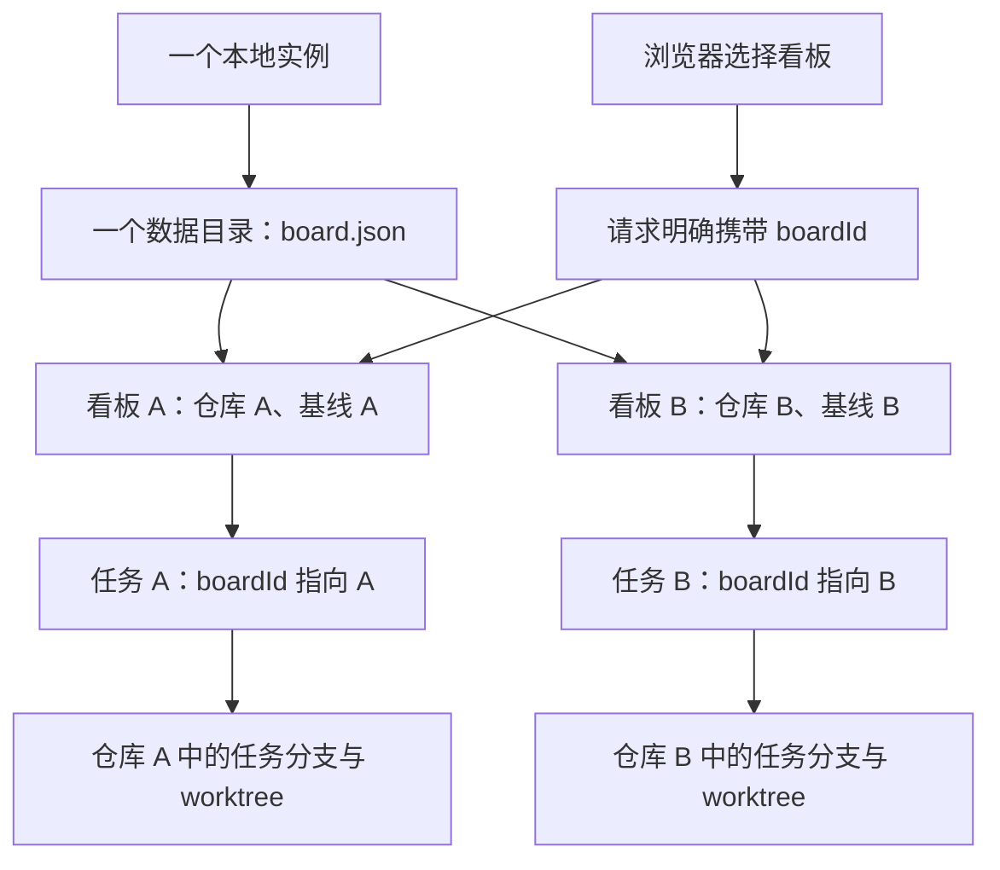
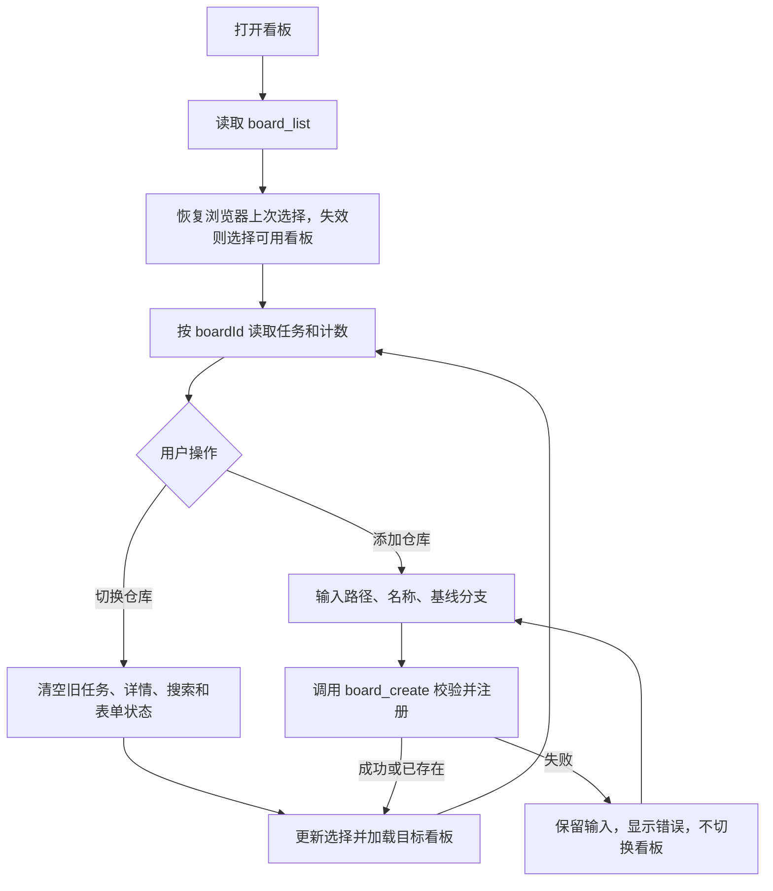

# 多仓库切换执行计划

- 状态：已完成（2026-10-03 实施，浏览器独立模式验收通过；Codex 原生侧栏验收仍属宿主接入后续工作）
- 创建日期：2026-10-03
- 最后更新：2026-10-03
- 负责人：Codex 主代理负责文档与整合；实现负责人待执行时分配。
- 关联历史记录：[多仓库看板隔离实施记录](../../histories/2026-10/20261003-1422-multi-repo-board-isolation.md)。

本文规划 `codex-kanban-mcp` 的多仓库管理能力。
现有使用说明见 [WORKFLOW.md](../../../WORKFLOW.md)；实施完成后再同步更新其中的单仓库限制。
计划维护遵循 [PLANS_GUIDE.md](../../PLANS_GUIDE.md) 与
[执行计划模板](../templates/execution-plan.md)，完成后保留文件名移至 `completed/`。

## 1. 目标与范围

让一个本地看板实例管理多个 Git 仓库，用户可以在界面中添加和切换仓库。
每个仓库对应一个看板，分别显示自己的任务、状态计数和 Git 上下文。
UI 与 Agent 继续通过同一套 MCP 工具读写同一份数据。

本轮交付：

- 添加已有的本地 Git 仓库，并设置看板名称和基线分支。
- 在窄栏和宽视图中切换仓库，记住当前浏览器的选择。
- 按看板隔离任务列表、状态计数、详情和任务写操作。
- 根据任务所属看板创建分支/worktree、生成变更摘要。
- 保留已有单仓库任务、执行记录和 Git 绑定关系。
- 补充自动化测试、真实临时 Git 仓库验证和浏览器验证。

本轮不扩展用户登录、角色权限、远程仓库克隆、任务跨仓库迁移、仓库删除、
自动合并、真实 Agent 运行时或 Codex 原生侧栏接入。
多仓库隔离属于数据归属管理，不等于用户权限隔离。

## 2. 当前代码中的缺口

| 位置 | 当前行为 | 需要调整 |
| --- | --- | --- |
| `packages/core/src/work-item.ts` | 任务没有看板归属字段 | 增加 `boardId` |
| `packages/core/src/board-store.ts` | 存储包含看板数组，但没有添加接口 | 增加原子注册、仓库去重和按看板过滤 |
| `packages/core/src/engine.ts` | 所有看板计数来自全部任务；Git 路径写死 `default` | 按任务归属统计和读取 Git 配置 |
| `mcp/src/register.ts` | 只有 7 个工具，任务接口没有看板参数 | 新增 `board_create` 和归属参数 |
| `ui/src/state/BoardContext.tsx` | 固定取第一个看板，读取全部任务 | 管理看板列表、当前选择和请求竞态 |
| `ui/src/components/AppHeader.tsx` | 仅展示项目名 | 增加仓库选择与添加入口 |
| `scripts/`、文档 | 按单仓库工具契约编写 | 更新冒烟、集成验证和使用说明 |

## 3. 目标结构与关键决策



1. **一个实例共享一份数据文件**：多个看板存放在同一个
   `CODEX_KANBAN_HOME/board.json` 中，不通过重启 bridge 切换仓库。
2. **一个仓库对应一个注册看板**：规范化实际目录，并使用 Git 公共目录识别
   仓库身份。子目录、符号链接和同仓库的 worktree 不应创建重复看板。
3. **任务必须有归属**：`WorkItem.boardId` 是持久化字段，创建后本轮不允许修改。
   任务 ID 在整个数据集全局唯一，避免不同仓库出现相同任务 ID。
4. **当前选择属于客户端**：保存在浏览器中，服务端不维护全局“当前仓库”。
   切换 UI 不应改变 Agent 或另一个浏览器正在操作的仓库。
5. **跨看板操作必须校验**：UI 的任务调用明确携带 `boardId`，服务端核验
   `task.boardId`，避免陈旧卡片、详情或拖拽操作写入错误看板。
6. **后台任务继续运行**：切换仓库只切换展示，不自动 Stop、重派或重建 worktree。
7. **环境变量仅初始化默认看板**：新增看板使用 MCP 注册接口；已有配置继续
   以数据文件为准。`CODEX_KANBAN_GIT` 仍是各 MCP 进程自身的 Git 功能开关。

数据结构示意：

```json
{
  "version": 2,
  "boards": [
    { "id": "default", "name": "项目 A", "repo": "/repos/a", "baseBranch": "main" },
    { "id": "board-b", "name": "项目 B", "repo": "/repos/b", "baseBranch": "develop" }
  ],
  "tasks": {
    "TASK-101": { "boardId": "default", "title": "任务 A" },
    "TASK-102": { "boardId": "board-b", "title": "任务 B" }
  }
}
```

这是归属关系示意，不是可直接使用的完整存储文件；执行状态、时间线、序号等
现有字段需要保留。

## 4. MCP 接口契约

### 4.1 看板接口

- `board_list()`：返回 `{ boards }`，每个看板携带本仓库的各状态计数和任务总数。
- 新增 `board_create({ repo, name?, baseBranch? })`：注册已有本地 Git 仓库，
  返回 `{ board }`；基线分支默认 `main`，名称省略时使用仓库目录名。
- `repo` 必须是绝对路径，并验证 Git 工作区、仓库根目录和存在的本地基线分支。
  无提交仓库、裸仓库、非法分支和不存在的路径应返回清晰错误，不自动初始化仓库。
- 同一仓库重复注册时返回已有看板，不改变已有名称、基线或任务归属。
  从任务 worktree 注册时应识别主仓库，而不是产生新的项目。
- 仓库校验采用参数数组调用 Git，不拼接 shell 命令。
  本轮注册校验仍需要可用的 Git，即使运行配置关闭了任务 Git 功能。

### 4.2 任务接口

| 工具 | 新增参数与规则 |
| --- | --- |
| `task_list` | `boardId?`：返回指定看板的任务，其他过滤条件继续生效 |
| `task_create` | `boardId?`：新任务归属于指定看板 |
| `task_get` | `boardId?`：传入时校验任务归属 |
| `task_update` | `boardId?`：作为归属校验，不是可修改的任务字段 |
| `task_move` | `boardId?`：流转前校验归属 |
| `task_assign` | `boardId?`：指派前校验归属，Git 使用任务所属看板 |

省略看板参数的规则：

- 列表与创建：只有一个看板时可自动解析；存在多个看板时必须明确指定，
  否则返回 `VALIDATION`，不得悄悄操作第一个看板。
- 按任务 ID 读取或修改：任务 ID 全局唯一，省略时使用任务自身归属；
  明确传入错误归属必须拒绝，不能回退到其他看板。
- 不存在的看板返回 `BOARD_NOT_FOUND`；任务不属于传入看板返回
  `BOARD_MISMATCH`。错误处理需同步到核心错误类型和 MCP 返回通道。

Agent 工作流：`board_list` → 确认目标 `boardId` → 创建或查询任务 →
读取任务返回的仓库/worktree → 执行原有任务流程。
新增工具后契约总数为 8 个，需同步冒烟脚本和文档。

## 5. 旧数据升级与并发处理

- 升级仅处理数据文件版本和任务归属；保留原任务 ID、执行记录、`sessionId`、
  分支、worktree、时间戳及 ID 序号，不重新分配或重建工作区。
- 旧版单看板任务归属于原 `default` 看板；旧文件只有一个非默认看板时，
  归属于该唯一看板。旧文件若已有多个看板且任务缺少归属，应报告歧义，
  不能猜测或把任务静默放到第一个看板。
- 升级在文件锁内重读最新数据，并保留原始文件备份，再原子写入版本 2。
  升级失败时原文件保持可用；重复读取或启动不应重复迁移。
- 任务已引用不存在的看板、未知文件版本、结构损坏等情况应明确报错，
  不通过清空数据或重建默认文件掩盖问题。
- 注册仓库先做 Git 校验，在文件锁内再次检查仓库身份是否已注册后写入，
  防止两个 MCP 进程并发创建重复看板。
- 两个 MCP 进程共用存储时，注册、任务写入和迁移都必须使用现有事务机制。
  上线时统一升级访问该文件的进程，避免旧进程覆盖新版本数据。
- JSON 文件锁不覆盖异步 Git 调用。两个进程同时指派同一任务时，需通过任务级
  跨进程互斥或幂等重查避免重复创建 worktree。复用已有工作区前核验仓库身份、
  分支和路径，不能把“目录存在”当成绑定正确。

## 6. UI 使用流程与请求隔离



界面要求：

- 顶部提供带名称的仓库选择器，显示当前仓库路径，并提供“添加仓库”入口。
  窄栏使用紧凑布局，宽视图沿用相同交互。
- 添加仓库采用本机绝对路径输入，填写名称和基线分支；不引入目录浏览 API。
  提交期间避免重复请求，失败保留输入。
- 当前选择存入浏览器本地存储；刷新后先验证 ID 是否仍存在，再恢复选择。
  没有看板或列表读取失败时，展示明确空态或错误态。
- 切换立即清空旧仓库列表和详情，重置新建表单、搜索、拖拽和打开的抽屉。
  可通过以 `boardId` 为组件 key 重置局部状态，避免残留输入写入新仓库。
- 每个异步请求捕获发起时的 `boardId` 和请求序号；只有仍匹配当前选择及最新
  请求的响应才能更新画面。覆盖 A → B → A 快速切换，而不仅比较任务 ID。
- 创建任务后继续指派等多步动作，始终使用创建时捕获的 `boardId`，
  不因用户中途切换而改写到新仓库。旧操作完成后不能关闭新仓库的表单。
- 断连期间保留当前数据并禁用写操作，恢复后重读看板列表和当前仓库任务。
- UI 的选择不会发送 Stop 或修改后台任务的执行态。

## 7. 执行顺序与并行边界


| 阶段 | 交付与完成条件 | 文件边界 |
| --- | --- | --- |
| P0 契约 | 固定 `boardId`、错误语义、仓库去重和升级规则 | 本执行计划 |
| P1 核心 | 任务归属、原子注册、旧数据升级、看板统计及单测 | `packages/core/` |
| P2 接口与 Git | 8 个 MCP 工具、归属校验、按看板路由 Git、契约测试 | `mcp/`，Git 引擎由核心负责人修改 |
| P3 UI | 选择器、添加表单、恢复选择、防竞态、断连处理 | `ui/` |
| P4 整合 | 构建、自动化测试、真实 Git 和双进程验证通过 | `scripts/`，协调各自测试文件 |
| P5 验收 | 窄/宽浏览器实测与说明同步，记录仍待宿主验证的边界 | `README.md`、`WORKFLOW.md`、`ui/README.md`、`extension/README.md` |

核心与 MCP 可由同一代理负责，UI 由另一代理负责，在契约固定后并行推进。
测试脚本和文档由主代理整合。每个文件只分配一个写入负责人；
依赖数据模型的构建和整合测试在对应实现完成后串行执行。

执行清单：

- [x] P0：检查最新工作区变更，确认接口与测试边界。
- [x] P1：实现任务归属、存储注册、旧文件升级和独立统计。
- [x] P2：实现 MCP 接口、归属校验和任务所属仓库的 Git 路由。
- [x] P3：实现添加/切换仓库、持久化选择和请求竞态隔离。
- [x] P4：补充测试，完成构建、真实 Git 和双进程验证。
- [x] P5：完成浏览器实测、问题修复和文档同步。

## 8. 验收标准

### 8.1 数据与接口

- 同一实例注册仓库 A、B 后，`board_list` 返回两个仓库看板及各自正确计数。
  默认未绑定仓库的旧看板可保留，不强行删除或改绑。
- A、B 的任务列表互不混入；过滤状态、优先级、指派类型后仍保持归属。
- 多看板下省略创建/列表的 `boardId` 会报错；无效 ID 和错归属写入均被拒绝。
- 重启后仓库、任务、会话与全局任务 ID 序号保持；旧单仓库样例升级无丢失。
- 同一仓库的子目录、符号链接、worktree 输入和双进程同时注册不产生重复看板。

### 8.2 Git 与执行

- 使用两个临时 Git 仓库和不同基线分支，确认指派分别生成正确分支/worktree。
- 移入 Review 时，A 的变更摘要不会读取 B，反之亦然。
- 双进程同时指派同一任务不生成重复工作区；发现已有工作区所属仓库或分支
  不匹配时明确报告，不能绑定或读取错误仓库。
- 切换仓库后，原任务执行态、会话标识、分支与工作区不变。
- Git 功能关闭或上下文创建失败时，任务仍可流转并明确显示缺失的 Git 上下文。

### 8.3 界面与竞态

- 在 360px、420px 和 1280px 宽度下检查选择器、添加表单、列表及详情。
- 刷新页面恢复选择；重复添加选中已有仓库；添加失败不切换、不丢输入。
- 快速 A → B → A、旧详情延迟返回、创建后中途切换、拖拽时切换，
  均不会展示或写入错误仓库的数据。
- 断连、重连、空看板和失效的已保存选择均有可用反馈。
- 多浏览器客户端分别选择不同仓库，互不改变对方当前选择。

### 8.4 验证执行要求

先跑构建、UI 类型检查和新增归属/迁移测试，再跑现有回归和扩展集成验证。
每次后台自动化测试设置硬超时 60 秒，超时终止对应测试进程并报告失败。
真实 Git 验证只使用临时仓库，不在用户项目创建测试分支或清理真实工作区。
浏览器测试使用内置 Chrome 工作流，覆盖实际点击与错误态并记录证据。

原有验证入口需适配新契约：

```bash
npm run build
npm run typecheck -w @codex-kanban/ui
npm run build:ui
npm test
npm run smoke
npm run verify:git
npm run verify:twoproc
npm run verify:bridge
```

这些是实施阶段的验证命令，本次编写计划不代表已执行或通过。
浏览器独立模式验收与 Codex 原生侧栏验收分别记录；原生宿主接入仍是后续工作。

## 9. 风险与回滚

- **旧数据丢失或归属错误**：迁移前保留原始文件，锁内重读并校验归属，
  遇到多看板旧数据歧义时停止；验收使用临时数据，不修改用户真实看板。
- **跨仓库写入或异步串板**：所有写操作校验归属，UI 响应按请求代次隔离，
  Git 操作核验真实仓库与分支，覆盖快速切换和双进程场景。
- **旧客户端访问新存储**：实施升级时统一停止并升级共享数据文件的进程。
  如需回滚，停止全部写入，保留版本 2 数据副本，再恢复版本 1 原始备份和原代码。
  升级后新增的任务必须单独保留并核对，不能直接用旧备份覆盖而丢失。
- **已有 Git 成果保留**：回滚不重置分支、不移除 worktree，不清除用户修改；
  数据恢复后核对实际工作区与任务记录。

## 10. 进度记录

- [x] 2026-10-03：整理目标、接口、迁移、并行边界和验收标准。
- [x] 2026-10-03：按 Execution Plans 规范归入 `active/`，状态标记为待执行。
- [x] 2026-10-03：实现核心数据归属与旧数据升级（v2 存储、锁内迁移 + `.v1.bak` 备份、
  registerBoard 原子去重、withTaskLock 跨进程任务锁）。
- [x] 2026-10-03：实现 MCP 契约与 Git 路由（8 工具含 `board_create`；任务工具
  `boardId` 归属校验；assign/diff 按任务所属看板路由；worktree 复用前核验仓库身份与分支）。
- [x] 2026-10-03：实现多仓库 UI 并完成整合验证（选择器 + 添加表单 + localStorage 恢复 +
  请求代次隔离 + 切换清空与 key 重置；39 单测、smoke、git-verify、twoproc、bridge 全通过）。
- [x] 2026-10-03：浏览器独立模式实测通过（360/420/1280px、添加/切换/失败态、
  快速 A→B→A、刷新恢复、多标签独立、断连重连），文档同步完成；详见关联历史记录。
      Codex 原生侧栏内验收仍属宿主接入后续工作，未在本轮执行。

实施补充说明：

- `WorkItem.boardId` 为持久化必填字段；v2 加载时校验任务归属看板存在，
  缺失或悬空引用明确报错（`STORE_ERROR`），不静默清空。
- 注册校验 `GitService.validateRepoForBoard` 不受 `TASKLANE_GIT=off` 影响；
  仓库身份键为 git common dir（`repoKey`），旧看板首次注册时回填。
- 双进程并发指派经 `withTaskLock`（文件级任务锁 + 锁内重查）串行化，
  git-verify S7 验证不产生重复工作区。
- 实施期间工作区存在并行的品牌/术语重命名改动（`codex` → `agent`、
  TaskLane 品牌调整），本计划实现与其保持共存，未回退任何外部改动。

## 11. 决策记录

- 2026-10-03：采用一个实例、多个仓库看板、任务显式归属的结构；
  浏览器选择不改变 Agent 的目标仓库。
- 2026-10-03：先完成执行文档，功能代码暂缓实施。
- 2026-10-03：按用户要求将唯一计划移至 `docs/exec-plans/active/`；
  使用英文短横线文件名，移除根目录旧文件并同步引用。

## 12. 阻塞点与下一步

- 当前阻塞：无。
- 下一步：Codex 原生宿主接入（含多仓库选择器在宿主侧栏内的验收）仍属后续工作；
  仓库删除、任务跨仓库迁移、远程克隆保持范围外，需要时另立计划。
- 本轮范围外的新功能不自动登记为技术债；实施中确认的债务按
  [技术债追踪](../tech-debt-tracker.md) 记录。
