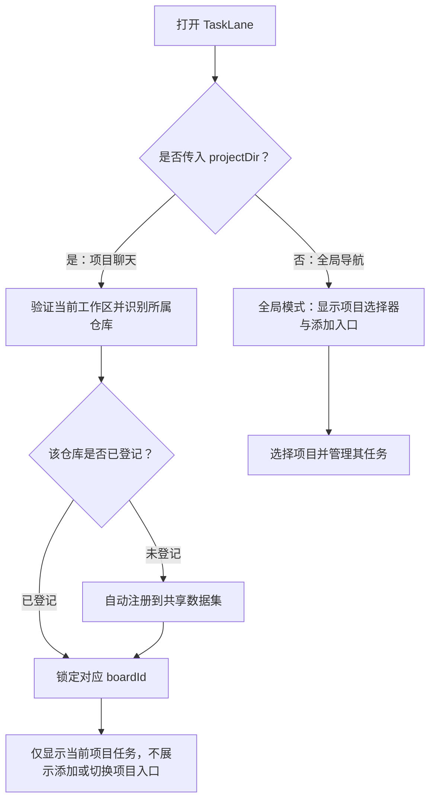

# 项目与全局看板入口执行计划

- 状态：已完成（2026-10-03 实施；插件契约经 verify:plugin 与 mock 宿主浏览器验收通过，Codex 原生宿主内验收待宿主接入后另行执行）
- 创建日期：2026-10-03
- 最后更新：2026-10-03
- 负责人：Codex 主代理负责方案与整合；实现负责人执行时分配。
- 关联历史记录：[项目与全局入口实施记录](../../histories/2026-10/20261003-1454-project-scoped-board-entrypoints.md)。
- 前置方案：[多仓库切换与任务隔离](../completed/multi-repo-board-isolation.md)。

## 目标

按打开入口区分两种使用模式：项目聊天内打开时锁定当前项目；
从 Codex 全局侧边栏打开时提供添加和切换项目的管理界面。
当前项目未登记时自动登记到同一个全局看板数据集，避免重复维护任务。

## 范围

- 包含：项目路径传入、已有仓库匹配、未登记仓库自动注册、两种模式的界面限制、
  widget 上下文保持及错误反馈。
- 不包含：用户权限系统、仓库克隆、切换 Git 分支、启动/停止真实 Agent、
  自动合并、任务跨仓库迁移或新增完整的 Git 状态监控面板。
- 项目模式是当前 widget 的操作范围约束，不是多用户权限边界。

## 背景

- 最新工作区已包含 `board_create`、任务 `boardId`、按所属看板的 Git 路由和
  UI 仓库选择逻辑；本计划不代表这些改动已完成构建、发布或运行验收。
- `extension/src/widget.mjs` 的 `open_tasklane` 目前不接收项目参数；
  返回的 widget 数据包含 `boardHome`，没有项目模式或锁定看板信息。
- `extension/src/plugin-server.mjs` 从 `defaultStorePath()` 创建共享数据实例；
  `ui/src/state/BoardContext.tsx` 恢复浏览器保存的看板选择，没有聊天项目匹配。
- Cowart 可参考的是明确传入项目路径、空参进入全局模式、后续调用沿用 widget
  返回的路径；不能依靠插件服务的启动目录推断聊天当前项目。
- 相关说明：[WORKFLOW.md](../../../WORKFLOW.md)；规范见
  [PLANS_GUIDE.md](../../PLANS_GUIDE.md)。

## 入口与数据规则

| 打开方式 | 项目选择 | 项目未登记时 | 数据来源 |
| --- | --- | --- | --- |
| 项目聊天内打开 | 锁定传入路径所属仓库，不允许切换 | 自动注册后打开该仓库看板 | 同一全局数据文件中该仓库的记录 |
| 全局侧边栏打开 | 允许添加、切换项目 | 用户通过添加入口登记 | 同一全局数据文件中的全部看板 |

本轮保留 `TASKLANE_HOME/board.json`，未配置时为 `~/.tasklane/board.json`。
项目模式仅限定展示和操作范围，不同时建立 `project/.tasklane/board.json`。
从两种入口查看同一仓库时，任务 ID、执行状态和时间线应完全一致。



### 项目路径与 Git 工作区

1. 项目聊天调用 `open_tasklane` 时明确携带绝对 `projectDir`，由调用方提供
   当前聊天实际工作目录；不使用插件目录或全局 App 聊天目录代替。
2. 服务端验证路径并识别 Git 仓库，使用公共 Git 目录匹配看板。
   在子目录或 worktree 中打开时复用同一仓库看板，不重复登记。
3. 同时保留 `projectDir` 与主仓库 `repoRoot`：前者表示聊天所在工作区，
   后者表示看板对应的仓库身份，不能把二者混为一谈。
4. 若以后新增“当前工作区 Git 状态”，从 `projectDir` 读取当前分支、HEAD
   和未提交改动；某任务的变更摘要仍从 `task.worktreePath` 读取。
5. 非 Git 目录、路径无效或注册失败时，明确提示并停止打开项目看板，
   不自动回退到全局第一个仓库。无提交仓库沿用现有注册规则，显示原因。

### 自动注册

- 优先按仓库身份匹配现有看板，匹配成功时不覆盖名称或基线配置。
- 只有未登记时才使用已有注册流程创建；重复打开和并发打开不得产生重复看板。
- 未登记仓库的基线需要明确解析：先使用调用中明确传入的 `baseBranch`，
  否则采用现有默认 `main` 并验证。默认分支不存在时提示补充基线，
  不创建错误绑定，也不擅自修改仓库的分支或配置。
- 自动登记属于此次项目打开行为；不会扫描其他目录或批量导入其他仓库。

## 接口与界面约束

扩展现有打开工具，不另建重复入口：

```json
{
  "projectDir": "/path/to/current-workspace",
  "baseBranch": "main"
}
```

- `projectDir` 有效时进入项目模式；空参数 `{}` 进入全局模式。
  传入空白路径视为无效项目参数，应报错，避免误触发全局模式。
- 打开结果返回 `mode`、`boardHome`；项目模式额外返回规范化 `projectDir`、
  `repoRoot` 和 `lockedBoardId`，前端应等上下文就绪后再加载任务。
- 不在服务进程中保存全局可变的“当前仓库”或“项目模式”，每个 widget
  独立保留打开时的上下文。项目 A、项目 B 和全局看板可以同时打开。
- 项目模式隐藏项目选择器和添加项目入口，保留当前项目名称与路径显示。
  `switchBoard`、`addBoard` 的状态入口也要遵守模式限制，不能只隐藏按钮。
- 项目模式不读取也不改写全局模式保存在 localStorage 中的项目选择，刷新与重连
  始终恢复 `lockedBoardId`。全局模式继续使用自己的浏览器选中状态。
- 项目模式的所有任务调用显式带锁定的 `boardId`，服务端核验任务归属。
  当前模型仍是单用户共享访问，不据此声称用户无法通过其他 MCP 调用访问别的看板。
- 上下文缺失或目标无效时禁用任务写操作；旧异步响应不能替换新 widget 的项目。
- 打开或切换项目不执行 checkout、不移动任务、不停止或重派 Agent。

## 风险与回滚

- **共享与本地双份数据**：保持单一共享数据来源，避免项目和全局各自维护任务。
- **错用工作区**：显式区分聊天工作区、主仓库和任务工作区；项目解析失败不回退。
- **上下文串用**：模式与锁定 ID 按 widget 实例保留，不使用服务端全局变量，
  不让项目模式受全局 localStorage 选择影响。
- **自动登记失败**：沿用事务注册与校验，不修改已有绑定；失败保留错误原因。
- 本计划不增加存储版本迁移。回滚保留已登记的仓库与任务，恢复原打开入口；
  不删除自动注册记录、分支或 worktree，不回滚用户在此期间完成的任务更新。

## 里程碑与并行边界

1. 固定打开契约、两种模式和无效路径行为，核对当前多仓库实现状态。
2. 插件/MCP 负责人修改 `extension/src/`：解析项目、复用注册逻辑、返回打开上下文。
   核心目录如需新增辅助方法，由核心负责人独占修改。
3. UI 负责人修改 `ui/`：接收打开结果、锁定项目模式、隔离全局选择、处理重连。
   第 2、3 步可在契约固定后并行，文件负责人不得交叉写入。
4. 主代理整合验证、构建插件产物并同步使用说明；构建与验收依赖实现完成。

## 验证方式与验收标准

- 项目 A 打开只显示 A；此前全局选择 B 也不能影响它。
- 未登记的 A 自动登记一次；再次打开、从子目录/worktree 打开、并发打开均复用。
- 同一仓库通过项目入口与全局入口查看时，任务和时间线一致。
- 项目模式不存在添加或切换入口；全局模式可以添加并切换 A、B。
- 同时打开项目 A、项目 B 和全局模式，操作目标互不串用。
- 注册失败、基线不存在、路径失效和上下文未就绪时，不显示其他仓库任务。
- 刷新、重连和异步延迟返回后，项目模式仍锁定原项目。
- Git worktree 中打开时，保留真实聊天目录；不以主仓库当前分支替代它。
- 自动注册和打开均不改变仓库检出的分支或任务执行状态。

实施阶段按实际变更选择命令：

```bash
pnpm build
pnpm test
pnpm smoke
pnpm verify:git
pnpm verify:twoproc
pnpm --filter @tasklane/ui typecheck
pnpm build:ui
pnpm build:plugin
pnpm verify:plugin
```

后台测试每次硬超时 60 秒；Git 和存储验证使用临时仓库与数据。
浏览器独立模式与 Codex 原生项目/全局入口分别验收，不能相互替代。
实际结果（2026-10-03 实施）：以上命令全部通过；浏览器验收使用 mock 宿主
（postMessage 协议 + bridge WebSocket）驱动真实插件 widget 完成，
Codex 原生宿主内验收待宿主接入后执行。

## 进度记录

- [x] 2026-10-03：整理两种入口、自动注册、共享数据和工作区路径规则。
- [x] 2026-10-03：核对实施时最新多仓库代码并分配文件负责人。
- [x] 2026-10-03：实现插件项目上下文及 UI 两种模式。
- [x] 2026-10-03：完成接口、竞态、真实 Git 和宿主入口验收。
- [x] 2026-10-03：更新实际结果与实施历史，在授权范围内归档。

实施补充说明：

- `open_tasklane` 经 zod schema 声明 `projectDir?/baseBranch?`；空对象进入全局模式，
  空白/相对路径返回 `VALIDATION`，不误触发全局模式。
- 核心层新增 `GitService.identifyRepo`（身份识别，不含基线校验）与
  `BoardEngine.resolveProjectBoard`（已登记仓库按身份复用、忽略无效 baseBranch；
  未登记才走 `validateRepoForBoard` 全量校验）——修复了"已登记仓库传入不同
  基线被拒绝"的语义偏差。
- widget 上下文经 ext-apps `toolresult`（ONE_SHOT，connect 前注册 handler）送达；
  以 `window.name` 缓存实现 iframe 重载恢复（不用 sessionStorage：其按 tab+origin
  共享，多 widget 并存会串板）；宿主重建 iframe 时自然清空。
- 浏览器验收发现并修复两处缺陷：① 连接初始化 effect 依赖闭环导致 widget 反复
  重握手（重建风暴）；② project-error 模式下头部仍渲染仓库选择器且
  switchBoard/addBoard 守卫未覆盖该模式（错误态泄漏全局入口）——现在所有
  非 global 模式一律锁定，写入口（新建表单/模板/宽视图）同步禁用。
- 验收环境：mock 宿主页（postMessage 协议 + bridge WebSocket）驱动真实 widget
  bundle；双 widget 并存（项目 X / 项目 Y / 全局）隔离、重载恢复、错误态、
  全局切换全部通过。真实 Codex 宿主内验收仍待宿主接入。

## 决策记录

- 2026-10-03：项目聊天只操作当前项目，未登记时自动加入共享看板数据集；
  全局侧边栏保留项目添加和切换功能。
- 2026-10-03：复用同一份数据，不采用此前讨论的项目本地独立数据文件。
- 2026-10-03：当前工作区路径显式传递，不能从插件服务的 cwd 推断。

## 阻塞点与下一步

- 当前阻塞：无技术阻塞。
- 下一步：Codex 原生宿主接入后，在真实项目聊天与全局侧栏中复验两种入口
  （含 worktree 工作区打开场景）；当前 Git worktree 场景已在 verify:plugin
  与 git-verify 的子目录/worktree 归位用例中覆盖。
- 明确推迟的完整 Git 状态监控属于后续功能范围，本次不自动登记为技术债。
